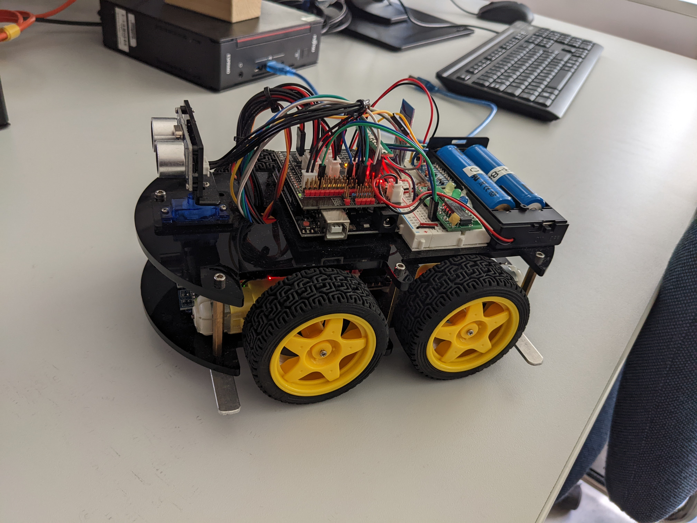
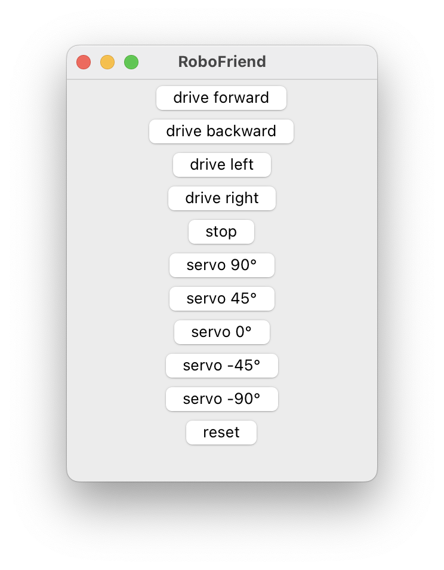
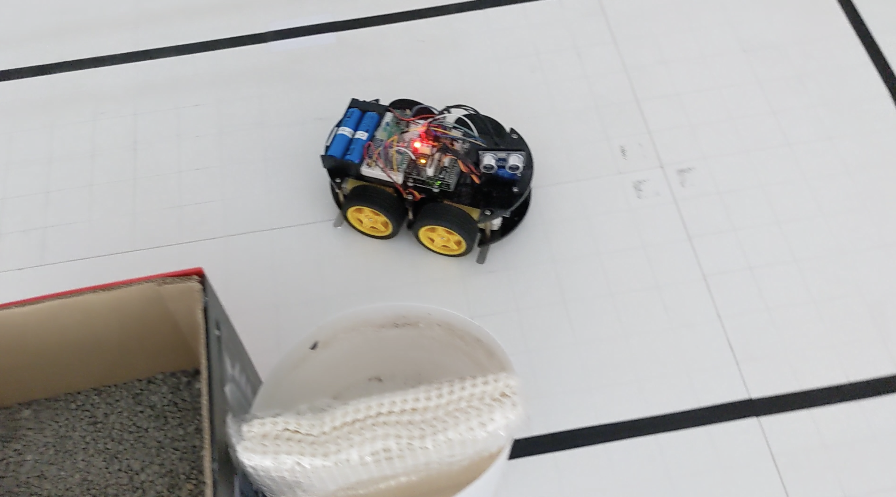

# Table of Contents {#table-of-contents}
- [Table of Contents](#table-of-contents)
- [About this project](#about-this-project)
  - [What is the ATMega328P?](#what-is-the-atmega328p)
  - [The car](#the-car)
- [The current state](#the-current-state)
  - [What's working (basics)](#whats-working-basics)
  - [Commands](#commands)
  - [Additional Features](#additional-features)
    - [Obstacle avoidance](#obstacle-avoidance)
    - [Remote GUI](#remote-gui) 
  - [What's next](#whats-next)
- [Code design](#code-design)
- [Images](#images)

# About this project {#about-this-project}
This project aims to create a self driving robot car. The code is written for the ATMega328P microprocessor (C-language) but can easily be adapted to work with other avr microprocessors. The car should be able to use its [components](#the-car) to drive along a pre built track. As for the track, it has a black line the car should follow. The goal is that the car can drive 3 rounds along the line (without any problems like changing directions or ignoring corners) while printing messages through the USART and receive commands while doing so.

## What is the ATMega328p {#what-is-the-atmega328p}
The ATMega328P is a microprocessor with 32kB flash storage and 2kB memory. Because of this limitations the code has to be extra carefully written to not exceed any memory limits. Further information about this microprocessor can be found [here](https://www.microchip.com/en-us/product/ATmega328P).

## The car {#the-car}
At the core the car is built around the ATMega328P microprocessor and features 2 independant motors, 3 infrared sensors, 3 leds attached to a shift register, a bluetooth module attached to the USART and an ultra sonic sound sensor mounted on top of a servo motor.

# The current state {#the-current-state}
In the following i will describe what is already working and what will come next or is nearly finished and should be worked on in the future.

## What's working (basics) {#whats-working-basics}
If you power on the car it will detect whether or not it sits on the start block. If not it will ask you to put it there, otherwise it will ask you to start the motors with the 'S' command or show a list of all available commands with '?'.
After you put the car on the start block and give it the 'S' signal it will immediately start driving down the start block and follow the black line of the track. While doing so it gives status prompts to show you the number of rounds it already drove. The 3 leds will show you in realtime which infrared sensor 'sees' the black line. The car is also programmed to smoothly steer when driving on a straight line (to correct itself) and steer harder when it detects a hard corner. After the third round it will stop driving and resets itself after 5 seconds (using a watchdog timer).

## Commands {#commands}

| Symbol     | Effect                                                    |
|:----------:|:--------------------------------------------------------- |
| 'S'        | Starts the engines and drive on the black line            |
| 'R'        | Resets itself and don't receive any new commands          |
| 'P'        | Pauses or unpauses driving on the line                    |
| 'X'        | Safe state. Don't react to anything until reset manually  |
| 'C'        | Drive back to the start block and reset there immediately |
| <pre style="color:green">'A'</pre> | <pre style="color:green">Enable/disable obstacle avoidance mode (Feature)</pre>   |
| <pre style="color:red">'PY'</pre> | <pre style="color:red">Enter the internal py-mode</pre>   |
| '?'        | Show the list of available commands                       |

<pre style="color:green"> *feature commands </pre>
<pre style="color:red"> *internal commands </pre>


## Additional Features {#additional-features}
In addition to the basic functionality required by the client the car is also able to avoid obstacles ([Obstacale avoidance](#obstacle-avoidance)) and a remote hardware test executor ([Remote GUI](#remote-gui)).

### Obstacle avoidance {#obstacle-avoidance}
This feature can be enabled or disable as you desire using the command described under [Commands](#commands). It aims to detect obstacles while driving down the track and avoid them by driving around them. It has intelligent detection in which direction it should try to drive around the obstacle.

### Remote GUI {#remote-gui}
Also shipped with the source code you will find a python programm called RoboFriend. To start it simply type the following from the cloned root directory:
```Sh
python robot/robofriend/RoboFriend.py
```
RoboFriend will immediatly try to connect to the robot on port `/dev/rfcomm0` and acts like a remote / remote hardware test executor.

## What's next {#whats-next}
The plans to have a desktop unit test application have already been created. But since the work that has already been done was not compilable yet (because basically all of the mocking hasn't been done yet) I decided to exclude this work for now.

# Code design {#code-design}
The code is designed to use an event based control flow. See `EventSystem` class on how to use that. This however result in a cleaner approach to handle different tasks. For example the car should drive down the track using an update method while being able to process commands through the USART. Normally one would write something like:
```C
while (true) {
  process_commands();
  drive_on_line();
}
```
This becomes awful quite fast since every update-method has to be handled inside the while loop. But instead now it becomes possible to have listeners that will be called when a specified event has been triggered. For example:
```C
EventSystem_reg_listener(
      EventSystem_instance(),
      Listener_create_r(&atmega, presentation_update, timer.event));
EventSystem_reg_listener(
      EventSystem_instance(),
      Listener_create_r(usart, presentation_handle_command, usart->event));
EventSystem_run(EventSystem_instance());
```
This will result in a much cleaner code style since you don't have to have huge while-loops.

# Images {#images}
{html: width=50%}
{html: width=50%}
{html: width=50%}
{html: width=50%}